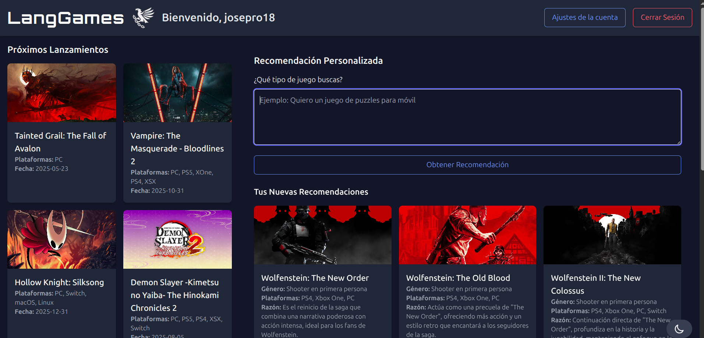
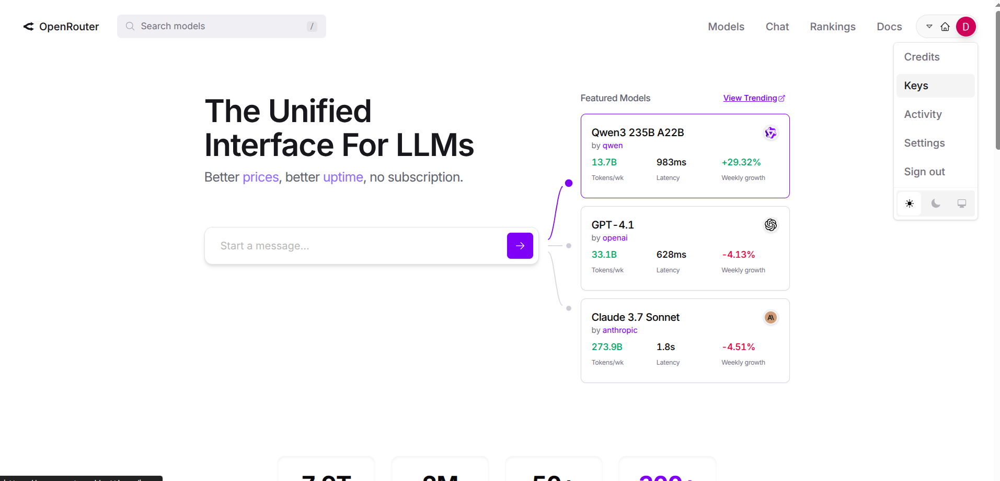
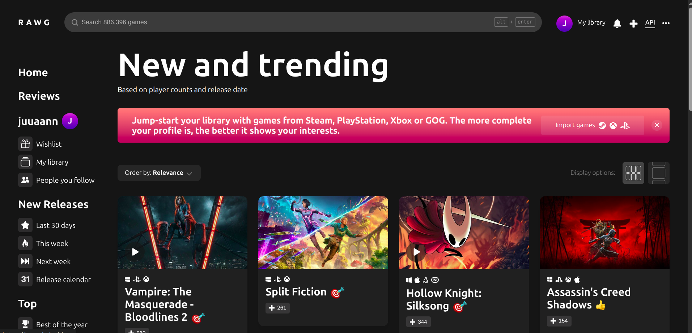

# TFG: LangGames



**Sugerencias de juegos con LangChain: Desarrollo de un sistema web de recomendaciones de videojuegos personalizadas a través de LangChain**

Autor: Juan Manuel Garzón Ferrer
Tutor: Ignacio Javier Pérez Gálvez

Palabras clave: TFG, LangChain, LangGraph, LangSmith, procesadores de lenguajes, recomendaciones, sugerencias, videojuegos, recomendación de videojuegos, sugerencias de videojuegos.

### Consideraciones previas

**MUY IMPORTANTE**: Para que este proyecto funcione correctamente, es necesario crear un archivo llamado **.env** dentro de la carpeta **backend**.

La estructura del archivo debe ser la siguiente:

```env
OPENROUTER_API_KEY=key1  
RAWG_API_KEY=key2  
JWT_SECRET_KEY=key3  
STEAM_API_KEY=key4
```

A continuación, se explica para qué sirve cada clave y cómo obtenerla:

#### OPENROUTER_API_KEY
Clave necesaria para acceder a los modelos de lenguaje, el motor principal de este proyecto.  
Puedes obtenerla creando una cuenta en la página oficial de OpenRouter:  
[enlace](https://openrouter.ai/)



#### RAWG_API_KEY
Clave para obtener imágenes e información de videojuegos.  
Puedes conseguirla registrándote en el sitio web oficial de RAWG:  
[enlace](https://rawg.io/login?forward=developer)



#### JWT_SECRET_KEY
Clave secreta utilizada para firmar y verificar los tokens JWT (JSON Web Tokens) en el sistema de autenticación.  
Esta clave asegura que los tokens generados para los usuarios (por ejemplo, al iniciar sesión) sean seguros y no puedan ser manipulados por terceros.

**Cómo obtenerla**:  
No se obtiene de un servicio externo, sino que debe generarse manualmente de forma segura. Puedes crear una clave aleatoria utilizando uno de los siguientes métodos:

En Python:
```python
import secrets
print(secrets.token_hex(32))
```

En la terminal (con OpenSSL, método usado en este proyecto):
```bash
openssl rand -hex 32
```

#### STEAM_API_KEY
Clave obtenida a través de Steam. Para acceder a ella, necesitas tener una cuenta de Steam y haber gastado al menos 5 dólares (o su equivalente en tu moneda local).  

Puedes obtenerla aquí:  
[enlace](https://steamcommunity.com/dev/apikey)

---

### Instalación e inicio de la aplicación

Esta aplicación ha sido desarrollada para **Ubuntu**, por lo que se recomienda utilizar este sistema operativo o uno compatible. También puedes usar otros sistemas (por ejemplo, una máquina virtual con Ubuntu en Windows que tenga acceso a través de una IP compartida).

Para instalar el proyecto, basta con ejecutar el script **instalador.sh** desde la raíz del proyecto. Es decir, desde la terminal, ubicarse en la raíz y ejecutar:

```bash
./instalador.sh
```

Si el archivo no tiene permisos de ejecución, puedes asignárselos con:

```bash
chmod +x ./instalador.sh
```

(Este comando también aplica a cualquier otro script sin permisos de ejecución.)

Este instalador configura todo: base de datos, backend y frontend.  
Durante la instalación del frontend, aparecerán algunas preguntas de Angular. Se recomienda dejar todas las opciones por defecto (solo pulsa Enter).

Si necesitas reinstalar algún componente de forma individual (por ejemplo, si fue eliminado o falló), puedes ejecutar el instalador correspondiente dentro de su carpeta respectiva.

Una vez completada la instalación, el proyecto se ejecutará automáticamente en segundo plano. Las salidas del backend y frontend se guardan en sus respectivos archivos **log** en la raíz del proyecto, para evitar salidas molestas en la terminal.

Para detener los procesos, ejecuta:

```bash
./detener.sh
```

Esto finalizará los procesos que se ejecutaron en segundo plano.

Para volver a iniciar la aplicación, ejecuta:

```bash
./inicializarProyecto.sh
```


**Resumen**

Este proyecto se centra en la creación de una plataforma web que ofrezca recomendaciones personalizadas de videojuegos, utilizando la novedosa tecnología Langchain como aspecto clave para orquestar no solo las preferencias del usuario sino también las opiniones de diferentes LLMs como ChatGPT o GEMINI. La plataforma permitirá tanto a usuarios registrados como no registrados interactuar con el sistema, proporcionando recomendaciones basadas en los juegos que han jugado o en nuevas preferencias introducidas en tiempo real. Los usuarios registrados podrán beneficiarse de un historial que mejora las recomendaciones con el tiempo, mientras que los usuarios no registrados recibirán sugerencias inmediatas basadas únicamente en la información proporcionada en la sesión actual y novedades del momento.

La plataforma se integrará con APIs de los diferentes LLMs a través de LangChain para obtener datos extra sobre los videojuegos, como nuevos lanzamientos o clásicos de antaño, popularidad en comunidades específicas, u otros aspectos relevantes como accesibilidad y disponibilidad. El sistema analizará esta información para ofrecer recomendaciones adaptadas a los gustos personales, garantizando que los usuarios descubran nuevos juegos adecuados a sus intereses y necesidades.

Además, el uso de LangChain permite utilizar múltiples LLMs, lo que optimiza el rendimiento del sistema al facilitar la consulta de diferentes fuentes de datos en paralelo. Esto no solo mejora la rapidez de las recomendaciones, sino que también enriquece la calidad de las respuestas al incorporar una variedad de perspectivas y enfoques. LangChain proporciona una arquitectura flexible que se adapta a las necesidades del proyecto, permitiendo escalar y mejorar continuamente las capacidades de la plataforma conforme se integran nuevos datos y se reciben más interacciones de los usuarios.


**Suggestions for games with LangChain: Development of a web system for personalized video game recommendations using LangChain.**

Author: Juan Manuel Garzón Ferrer
Supervisor: Ignacio Javier Pérez Gálvez

Keywords: Bachelor's Thesis, LangChain, LangGraph, LangSmith, language processors, recommendations, suggestions, video games, video game recommendation, video game suggestions.


### Preliminary Considerations

**VERY IMPORTANT**: For this project to work properly, you must create a file named **.env** inside the **backend** folder.

The file structure should look like this:

```env
OPENROUTER_API_KEY=key1  
RAWG_API_KEY=key2  
JWT_SECRET_KEY=key3  
STEAM_API_KEY=key4
```

Below is an explanation of what each key does and how to obtain it:

#### OPENROUTER_API_KEY
Key required to access the language models, which are the core engine of this project.  
You can get it by creating an account on the official OpenRouter website:  
[link](https://openrouter.ai/)


#### RAWG_API_KEY
Key used to fetch video game images and information.  
You can obtain it by registering on the official RAWG website:  
[link](https://rawg.io/login?forward=developer)


#### JWT_SECRET_KEY
Secret key used to sign and verify JWT (JSON Web Tokens) in the authentication system.  
This key ensures that tokens generated for users (e.g., on login) are secure and can't be tampered with by third parties.

**How to obtain it**:  
It’s not provided by any external service—you must generate it manually in a secure way. You can use one of the following methods:

In Python:
```python
import secrets
print(secrets.token_hex(32))
```

In the terminal (using OpenSSL, as in this project):
```bash
openssl rand -hex 32
```

#### STEAM_API_KEY
Key obtained from Steam. To access it, you need a Steam account and must have spent at least $5 (or the equivalent in your local currency).

You can get it here:  
[link](https://steamcommunity.com/dev/apikey)

---

### Application Installation and Startup

This application was developed for **Ubuntu**, so it is recommended to use this OS or a compatible one.  
Alternatively, you can run it on other systems using, for example, a virtual machine with Ubuntu on Windows that can be accessed via IP.

To install the project, simply run the **instalador.sh** script from the root of the project. From the terminal, navigate to the project root and run:

```bash
./instalador.sh
```

If the file doesn't have execution permissions, assign them using:

```bash
chmod +x ./instalador.sh
```

(This applies to any script lacking execution permissions.)

The installer will set up everything: database, backend, and frontend.  
During the frontend installation, Angular may prompt some questions—just press Enter to keep the default options.

If you ever need to reinstall any component individually (due to deletion, failure, etc.), you can run the corresponding installer inside its folder.

After installation, the project will run automatically in the background.  
The backend and frontend logs are saved in their respective **log** files at the project root, to avoid cluttering the terminal output.

To stop the processes, run:

```bash
./detener.sh
```

This will terminate all background processes started during initialization.

To restart the application, simply run:

```bash
./inicializarProyecto.sh
```


**Abstract**

This project focuses on the creation of a web platform that offers personalized video game recommendations, using the innovative LangChain technology as a key aspect to orchestrate not only user preferences but also the opinions of different LLMs such as ChatGPT or GEMINI. The platform will allow both registered and non-registered users to interact with the system, providing recommendations based on the games they have played or new preferences introduced in real-time. Registered users will benefit from a history that improves recommendations over time, while non-registered users will receive immediate suggestions based solely on the information provided during the current session and current trends.

The platform will integrate with APIs from various LLMs via LangChain to collect additional data about video games, such as new releases or classic titles, popularity in specific communities, or other relevant aspects like accessibility and availability. The system will analyze this information to offer recommendations tailored to personal tastes, ensuring that users discover new games suited to their interests and needs.

Furthermore, the use of LangChain allows the utilization of multiple LLMs, optimizing the system's performance by enabling queries from different data sources in parallel. This not only speeds up the recommendations but also enhances the quality of the responses by incorporating a variety of perspectives and approaches. LangChain provides a flexible architecture that adapts to the project's needs, allowing for continuous scaling and improvement of the platform’s capabilities as new data is integrated and more user interactions are received.


